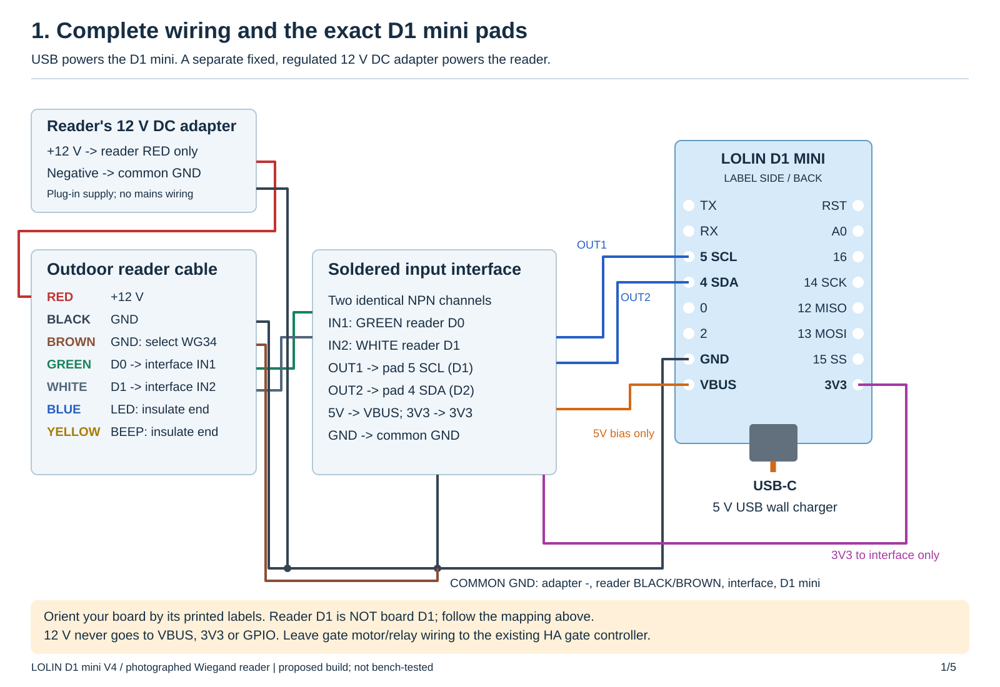

# Garage card reader for Home Assistant

Use the photographed **12 V Wiegand reader + LOLIN D1 mini** to scan cards into
Home Assistant. Scan a card, name it in **Settings > Tags**, then assign its
actions: open a garage, unlock a door, run a script, or a combination.
Adding or naming a card alone grants no access. Permissions live in Home Assistant.

**Start with [the wiring and setup guide](docs/garage-reader-setup.md).**



| File | Purpose |
|---|---|
| [garage-reader.yaml](garage-reader.yaml) | ESPHome firmware for the photographed D1 mini and Wiegand reader |
| [garage_reader.h](garage_reader.h) | Scan suppression; keep beside the YAML |
| [garage-secrets.example.yaml](garage-secrets.example.yaml) | Private Wi-Fi, API and OTA credential template |
| [GarageCardAction blueprint](blueprints/GarageCardAction.yaml) | Choose a card, reader, conditions and permitted actions |
| [Wiring diagram](docs/garage-reader-wiring.svg) | Power and two protected, inverting data inputs |

**Do not wire reader data directly to the ESP8266:** its GPIO uses 3.3 V.
Use the NPN input stages in the diagram and the matching inverted pin configuration.
Board GPIO5/printed `5` is **D1**, and GPIO4/printed `4` is **D2**. Board D1/D2
names differ from the reader's D0/D1 signal names.

Cards become `wg34-<decimal ID>` or `wg26-<decimal ID>` through HA's native tag
reporting path. The firmware checks parity through ESPHome, filters repeat scans,
drops offline scans and never operates a local relay. The guide describes the
physical checks still required, enrollment, revocation and access-control limits.

Garage development checks (ESPHome 2026.8.2 / Arduino 3.1.2):

```sh
g++ -std=c++17 -Wall -Wextra -Werror -fsanitize=address,undefined tests/test_garage_reader.cpp -o /tmp/garage-test
/tmp/garage-test
python tests/prepare_garage_compile.py
esphome compile .test-build/garage/garage-reader.yaml
python -m pytest -q tests/test_garage_home_assistant.py
```

Use Python 3.12 for ESPHome and Python 3.14 / HA 2026.9.1 for the HA tests.
The isolated compile uses dummy credentials: **never flash that test binary**.
This branch starts from `codex/movie-player` commit
`92cf30d5f5cbb8ab33836c2de577416cc1c8b424`. Original attribution and GPL licensing
remain in [LICENSE](LICENSE). The movie firmware and its documentation follow below.

## Movie Time NFC player for Kodi (previous application)

A fork of [adonno/tagreader](https://github.com/adonno/tagreader) for a child’s
DVD/Blu-ray case player. Insert a case to start its movie in Kodi through Home
Assistant. Play, Pause and Stop work as labelled; removing the case stops playback.

**Start with [the setup guide](docs/movie-time-setup.md).** It includes installation,
movie mapping, wiring, recovery and the checks to perform on your assembled player.

| File | Purpose |
|---|---|
| [movie-player.yaml](movie-player.yaml) | Firmware configuration for the original ESP8266 D1 mini |
| [movie_reader.h](movie_reader.h) | Required reader logic; put it beside the YAML |
| [secrets.example.yaml](secrets.example.yaml) | Copy/merge into your private ESPHome secrets file |
| [MovieTimeKodi blueprint](blueprints/MovieTimeKodi.yaml) | Select your reader, buttons and Kodi in Home Assistant |
| [Review and issue triage](docs/movie-time-review.md) | What was reviewed, addressed and still needs hardware testing |

The wiring is unchanged: PN532 on D1/D2, LED on D8, passive buzzer on D7,
Play on D5, Pause on D6, Stop on D0 with its external 10 kΩ pull-up to 3V3.

This version reads existing Home Assistant tag IDs and ordinary tag UIDs. It uses
persistent entity states, debounces case removal, preserves mute preferences and
avoids automatic playback on reconnect. Music-provider URL routing and tag writing
are absent from the movie firmware. The original `tagreader.yaml` remains for
reference and rollback; [its legacy instructions](docs/legacy-tagreader.md) do
not describe the movie player.

The tested firmware toolchain is **ESPHome 2026.8.2 / ESP8266 Arduino 3.1.2**.
Home Assistant tests execute the real blueprint with simulated Kodi responses.
Automated validation cannot certify your physical NFC reception, buzzer, wiring
or movie library: finish the bench checks in the setup guide before final assembly.

## Development checks

```sh
clang++ -std=c++17 -Wall -Wextra -Werror -fsanitize=address,undefined tests/test_reader.cpp -o /tmp/movie-reader-test
/tmp/movie-reader-test
python -m pytest -q tests/test_home_assistant.py
python tests/prepare_compile.py
esphome compile .test-build/movie-player.yaml
```

For the Home Assistant tests use Python 3.14.2+ and `requirements-test.txt`.
Install ESPHome 2026.8.2 in a separate Python 3.12 environment. The compile helper
creates an isolated build using dummy credentials; never flash that test binary.
Original project attribution and GPL licensing are retained in [LICENSE](LICENSE).
