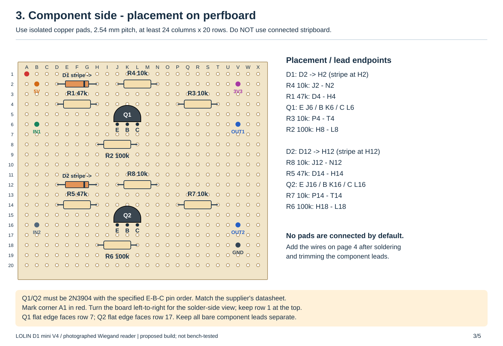
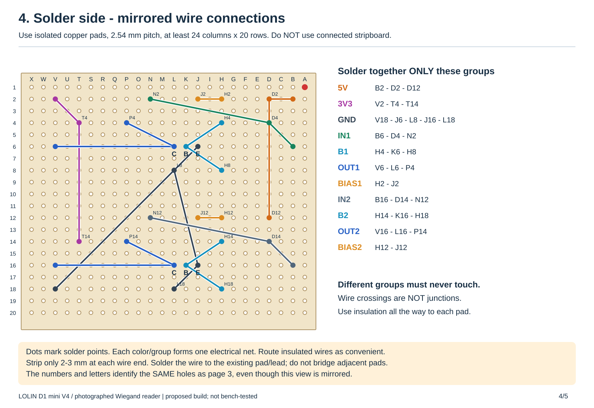

# Garage reader: wiring, installation and card rights

## Hardware shown in your photos

The board is a LOLIN D1 mini V4.0.0 (ESP8266). The reader sticker lists:

| Reader wire | Label / use | Connection |
|---|---|---|
| Red | VCC +12 V | Regulated 12 V DC positive |
| Black | GND | Common DC ground |
| Green | D0 | Input Q1, collector to GPIO5 / board D1 / printed `5 SCL` |
| White | D1 | Input Q2, collector to GPIO4 / board D2 / printed `4 SDA` |
| Blue | LED | Insulate separately; unused |
| Yellow | BEEP | Insulate separately; unused |
| Brown | Ground to output WG34 | Black/common ground, connect with power off |

Confirm brown's instruction on your actual sticker before connecting: wire colors
are not universal. Use WG34 consistently; changing between WG26/WG34 changes tag
IDs and requires reassignment of rights. The firmware accepts both. The photos do
not establish RF frequency or idle data voltage. Test your fob; tags compatible
with the movie reader's PN532 are not necessarily compatible with this reader.

## Parts and wiring

Use the [five-page printable wiring and soldering guide](../output/pdf/garage-reader-soldering-guide.pdf).
It shows your exact D1 mini pads, both electrical circuits, component placement,
the mirrored solder side, and the soldering sequence. It keeps your existing
reader and controller. The drawings now use **one fixed regulated 12 V adapter**
for both the reader and your purchased converter. The converter shown in your
screenshot is labelled **12/24 V input, 5 V / 3 A output**, with red/black input
wires and a **male USB-C output plug**. Plug that directly into the D1 mini;
no second wall adapter or separate USB cable is needed for normal operation.
It has a fixed output, so there is no adjustment screw to set with a meter.

The interface parts and reader power supply are **additional parts**; the two
photographed devices alone are not the complete build. The input circuit is a
proposed design for ordinary 0–12 V signals, not a measured specification of your
reader or a bench-tested assembly. Having no meter does not establish that direct
GPIO wiring would work. The converter supplies power only; it does not replace
the two NPN data interfaces.


Use a **fixed regulated 12 V DC plug-in supply**. Its capacity must cover the
reader plus the converter's input current for the D1 mini. The reader's draw
is unknown, so the earlier 12 V / 1 A suggestion is not a verified combined-load
requirement. A 12 V / 2 A supply provides more capacity for this small build,
but does not guarantee an unmeasured load. The converter's 5 V / 3 A marking is
its maximum output capacity, not the D1 mini's constant current draw.
Use a female barrel-to-screw adapter matching your supply plug and marked polarity.
Do not cut into or assemble mains wiring. Make the following DC connections with
the adapter unplugged:

| Connection | Wires / plug |
|---|---|
| Adapter positive (+12 V) | Reader RED and converter RED input |
| Adapter negative (GND) | Reader BLACK, reader BROWN, converter BLACK input, interface GND and D1 mini GND |
| Converter 5 V output | Its USB-C plug directly into the D1 mini USB-C socket |
| D1 mini VBUS | Interface pad B2, for the 5 V reader-line bias only |

Use a labelled insulated terminal connector or properly soldered, heat-shrunk
wire branches to split the +12 V and ground. Multiple wires in one screw terminal
are acceptable only if that terminal is designed to hold their sizes and number.
Check the actual converter label against the screenshot when it arrives.

For the complete two-channel interface, obtain:

| Quantity | Part |
|---|---|
| 2 | 2N3904 NPN transistors, TO-92, documented E-B-C lead order |
| 2 | 1N4148 axial diodes |
| 4 | 10 kΩ resistors, 1/4 W |
| 2 | 47 kΩ resistors, 1/4 W |
| 2 | 100 kΩ resistors, 1/4 W |
| 1 | Isolated-pad perfboard, 2.54 mm pitch, at least 24 columns × 20 rows; a 7 × 9 cm board is convenient |
| As needed | Insulated hookup wire, solder, flux, heat-shrink and an indoor enclosure |

These parts form the following circuit **for each data line**:

- One 2N3904 NPN transistor (Q1/Q2).
- One 47 kΩ resistor from reader data to base.
- One 100 kΩ resistor from base to ground.
- One 10 kΩ resistor from collector to board 3V3.
- One 10 kΩ reader-line pull-up fed from 5 V through a 1N4148 diode.

Use 1/4 W resistors. Check your transistor supplier's E/B/C lead order: BC547 and
other substitutions can have different physical pinouts. The diode's **stripe /
cathode faces the 10 kΩ resistor and reader data line**; its anode faces 5 V. This
provides an idle high for open-collector readers while blocking a higher reader
idle level from feeding back into 5 V.

Connect the emitter to ground and collector to the selected GPIO. The reader's
high turns the transistor on and makes the GPIO low; reader low makes GPIO high.
Both firmware inputs therefore require `inverted: true`. This proposed interface
handles ordinary 0–12 V logic, including open-collector or driven outputs. It is
not a certified outdoor lightning/surge isolator. Keep the GPIO wires short.

Power reader red and converter red from the adapter's +12 V. The converter's
fixed 5 V USB-C output powers the D1 mini.
The board's **VBUS pad supplies the interface's 5 V bias**; do not attach another
5 V supply to VBUS while USB is connected. Connect adapter negative, converter
black, reader black, reader brown, both emitters and board GND together. Board **3V3** supplies only the
collector pull-ups. Never feed 12 V to VBUS, 3V3 or GPIO. For flashing, the USB cable
must come from the computer instead of the converter: unplug the 12 V adapter,
remove the converter's USB-C plug, then connect the computer's USB cable.
After flashing, unplug the computer USB cable, reconnect the converter plug,
and power the 12 V adapter. Keep the common ground throughout. Never combine
the converter and computer USB supplies using a splitter.

## Detailed soldering layout

The two circuits have identical parts but different reference numbers:

| Use | Green / channel 1 | White / channel 2 |
|---|---|---|
| Input resistor | R1 47 kΩ | R5 47 kΩ |
| Base-to-ground resistor | R2 100 kΩ | R6 100 kΩ |
| Collector-to-3V3 resistor | R3 10 kΩ | R7 10 kΩ |
| 5 V reader-line bias resistor | R4 10 kΩ | R8 10 kΩ |
| Bias diode | D1 1N4148 | D2 1N4148 |
| Transistor | Q1 2N3904 | Q2 2N3904 |

Here **D1/D2 printed beside diodes are component references**, not the D1 mini's
GPIO names. The diode stripe is the cathode. In the physical layout the stripes
face holes **H2 and H12**. Resistors have no polarity.



Use **isolated individual copper pads**, not stripboard with connected copper
rows. Mark corner A1. Letters and row numbers refer to the component-side view;
turn the board left-to-right with row 1 still at the top to obtain the mirrored
solder-side view below. Insert each part into its named pair of holes. Solder and
trim the leads, then add insulated wires on the copper side. Use short exposed
wire ends; bare wires must not cross or touch unrelated pads.



Connect **all pads in each row of this table together**, and keep different rows
electrically separate. The builder checks the pad groups against the circuit's
component connections, but this cannot check your physical soldering.

| Electrical group | Solder these pads together |
|---|---|
| USB 5 V bias | B2, D2, D12 |
| 3V3 | V2, T4, T14 |
| GND | V18, J6, L8, J16, L18 |
| Reader D0 input / IN1 | B6, D4, N2 |
| Q1 base | H4, K6, H8 |
| Q1 collector / OUT1 | V6, L6, P4 |
| D1 cathode to R4 | H2, J2 |
| Reader D1 input / IN2 | B16, D14, N12 |
| Q2 base | H14, K16, H18 |
| Q2 collector / OUT2 | V16, L16, P14 |
| D2 cathode to R8 | H12, J12 |

External wires attach to these pads:

| Perfboard pad | External connection |
|---|---|
| B2 | Board VBUS, fed by USB, for bias only |
| V2 | Board 3V3 |
| V18 | Common ground |
| B6 | Reader green D0 |
| B16 | Reader white D1 |
| V6 | Board printed `5 SCL` / GPIO5 / board D1 |
| V16 | Board printed `4 SDA` / GPIO4 / board D2 |

Fit **Q1 emitter at J6, base at K6, collector at L6**, with its flat face toward
row 7. Fit **Q2 emitter at J16, base at K16, collector at L16**, flat face toward
row 17. This assumes the specified 2N3904 pin order; check the supplier's drawing
before soldering. Do not substitute a BC547 without remapping its legs.

Keep the 12 V adapter and computer USB unplugged throughout soldering. Solder the D1 mini headers
provided in your photos, or short insulated wires directly onto the named pads.
Do not join adjacent header pads. Assemble the perfboard using the PDF's sequence,
connect the external wires, and cover the blue/yellow reader wire ends separately.
Mount the perfboard and D1 mini indoors on spacers with strain relief; the reader
remains outside. The diagram does not provide weatherproofing for the controller
or certified surge protection for a long outdoor cable.

For **4-band** resistors with gold tolerance bands: 10 kΩ is brown-black-orange-gold,
47 kΩ is yellow-violet-orange-gold, and 100 kΩ is brown-black-yellow-gold. A 5-band
1% resistor has a different band pattern; use its supplier label rather than this
4-band lookup.

To rebuild the drawings and PDF, install `tools/requirements-wiring.txt`, then run
`python tools/build_garage_wiring_guide.py`.

No gate control wires connect to this reader. Home Assistant commands your
existing gate/door controller. If you need a new controller, use a separate
isolated dry-contact relay according to the gate manufacturer's control-input
instructions. Those terminals cannot be identified from these photos.

## Install and add the reader

1. Import `garage-reader.yaml` into ESPHome Device Builder and place
   `garage_reader.h` beside it. The PN532/movie YAML is for other hardware.
2. Merge `garage-secrets.example.yaml` into private `secrets.yaml`. Set Wi-Fi, a
   new 32-byte base64 API key and a unique OTA password. Generate a key with:
   ```sh
   python -c "import secrets,base64; print(base64.b64encode(secrets.token_bytes(32)).decode())"
   ```
3. Compile and flash over USB. CLI: `esphome run garage-reader.yaml`. Future
   updates can use OTA. The reproducible toolchain is ESPHome 2026.8.2 / Arduino
   3.1.2; use ESPHome 2026.8.2 or newer.
4. Add discovered **Garage Card Reader** under **Settings > Devices & services >
   ESPHome**, supplying your key. If discovery fails, add it by IP address.
5. In the ESPHome integration entry's **Configure** options enable **Allow the
   device to perform Home Assistant actions**. This is required for tag reporting.
6. Ensure HA's Tags integration is loaded (`default_config:` normally loads it;
   otherwise add `tag:` to `configuration.yaml` and restart). Wait for the
   **Ready for Cards** diagnostic entity to turn on.

There is no open fallback hotspot or reader web server. Recovery uses USB or OTA
with your configured credentials. Never flash the automated dummy-credential build.

## Read a card, add it, assign rights

1. With access automations disabled, scan a card once.
2. Open **Settings > Tags**. HA automatically adds the scanned tag, such as
   `wg34-12345678`. Name it **Rendy garage card**. The ID is a decimal Wiegand
   payload, not necessarily a printed card number or phone/movie-reader UID.
3. Under **Settings > Automations & scenes > Blueprints > Import blueprint**, use:
   ```text
   https://github.com/rendyhd/tagreader/blob/codex/garage-gate-reader/blueprints/GarageCardAction.yaml
   ```
   Or copy the blueprint to
   `/config/blueprints/automation/rendyhd/GarageCardAction.yaml` and reload blueprints.
4. Create an automation from **Garage card - assign door or script rights**.
   Select this reader, paste the exact tag ID, and choose its permitted actions
   using HA's normal action editor. Optional conditions can limit access hours,
   require a guest-access helper, or check a door state.
5. Save as **Rendy card - open garage**. Create another automation for another
   card/reader or another set of rights. No firmware change is needed.

Choose your real entities in the UI. Examples:

```yaml
# Dedicated gate opening command
- action: cover.open_cover
  target:
    entity_id: cover.garage_gate

# Or a script, called directly so cooldown starts after it finishes
- action: script.open_side_door
```

`script.turn_on` also works but launches the script asynchronously. For toggle-only
gate buttons use a script or condition that checks a reliable closed-state sensor
so repeated scans cannot close a gate that is already opening.

You may skip the blueprint and create an automation from the card's Tags page.
Set **Tag scanned** to this card and restrict its **Device** to this reader.
Do not trigger access from **Last Card** sensor changes: that diagnostic state
can be resent on reconnect and is not a fresh scan.

To revoke a lost card, disable/delete **all automations granting it rights**.
Deleting or renaming its Tags entry does not revoke automations matching its ID;
another scan can recreate that entry. A card can have multiple rights automations.

## Bench checks before enabling door actions

1. With the 12 V adapter and computer USB unplugged, compare every lead and pad group with the
   drawings. Inspect both sides with good lighting and magnification for solder
   bridges, touching bare leads and loose wire strands. Verify the adapter is
   labelled regulated 12 V DC and match its polarity to the connector labels.
   Check converter RED is on +12 V and BLACK is on ground. Its label must specify
   fixed 5 V output. Its USB-C plug powers the D1 mini; no adjustable buck is needed.
2. **If test equipment becomes available**, check ground continuity and supply
   polarity first. With GPIOs disconnected, measure green/white against black;
   the proposed circuit assumes ordinary 0–12 V logic. Powered collectors should
   idle low and remain at or below 3.3 V. A scope/logic analyzer should show a
   rise toward 3.3 V for each reader low pulse. Without equipment you cannot verify
   these levels or detect every soldering fault by visual inspection. The guide
   does not claim that the unmeasured reader or assembled interface is certified.
3. Connect GPIOs. Strap brown to ground with power off, then reboot. A scan should
   show **Last Frame Bits = 34** and **Last Card = wg34-...**. If Bits updates
   but Last Card does not, check polarity/wiring/parity with temporary DEBUG logs.
   If nothing changes, check reader power and card compatibility. The interface
   requires `inverted: true` on both pins.
4. Verify the Tags entry appears. If Last Card changes but Tags does not, check
   readiness, API permission, Tags integration and logs.
5. Assign a harmless notification first. Verify the selected card triggers it,
   other cards do not, and another reader with the same ID does not. Assign a
   second card a different action and check each gets only its assigned rights.
6. Hold a card in the field and check for repeated actions. Re-present after at
   least 2.5 s with no frames from that card and after cooldown. Firmware limits
   all scan reports to one per 2 s; the blueprint discards invocations during its
   actions and the extra 5 s default cooldown.
7. Disconnect HA/Wi-Fi, scan, and reconnect. No stored scan should execute. Remove
   and re-present after Ready for Cards returns. Logger-only connections do not
   count as HA. Reboot with a held card and test startup suppression too.
8. Disable its rights automation and verify it no longer acts. Test conditions,
   then replace the harmless action with your actual door/gate/script action.

Wiegand has no reliable removal signal. The quiet period is a repeat filter, not
proof of removal. First frames emitted only after startup readiness or repeat
gaps longer than the quiet period may count as new presentations. Adjust
`card_quiet_ms` for your hardware. The blue/yellow inputs remain disconnected;
the reader's own beep/LED means a physical read, not access granted.

Keep the Wi-Fi controller and connections inside the secured area. Wiegand and
card IDs can be copied/replayed; this provides UID-based automation, not
cryptographic access control. Retain the gate's normal obstruction/safety controls.

## Sources

- [WEMOS D1 mini: board and 3.3 V GPIO](https://www.wemos.cc/en/latest/d1/d1_mini.html)
- [ESPHome Wiegand](https://esphome.io/components/wiegand/)
- [ESPHome native API and tag reporting permission](https://esphome.io/components/api/)
- [Home Assistant Tags](https://www.home-assistant.io/integrations/tag/)
- [Tag trigger and reader restriction](https://www.home-assistant.io/docs/automation/trigger/#tag-trigger)
- [2N3904 ratings and pinout](https://www.onsemi.com/pdf/datasheet/2n3903-d.pdf)
- [1N4148 diode identification and ratings](https://www.vishay.com/docs/81857/1n4148.pdf)

Your sticker supplies the wire colors. The input circuit is a proposed design
that still requires the physical checks above.
