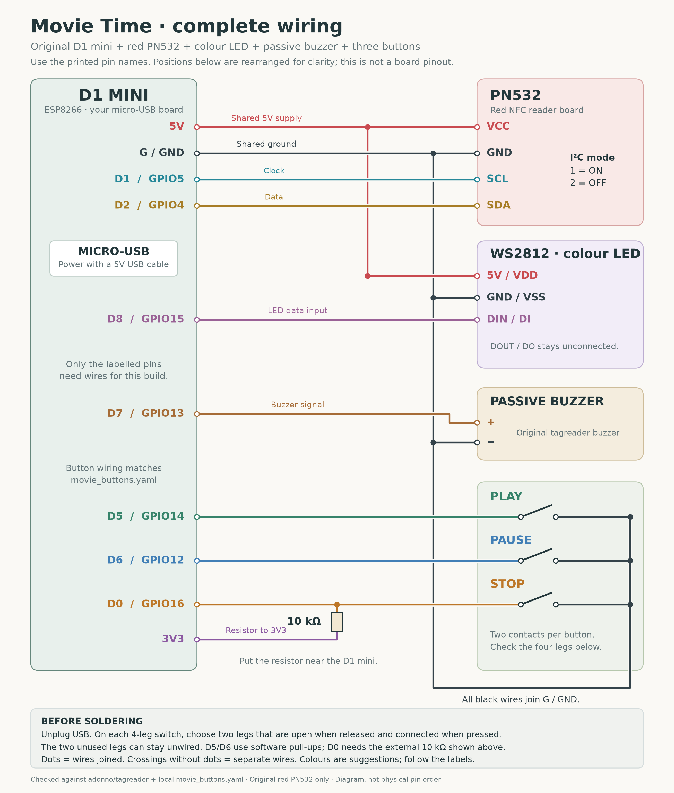

# Set up your Movie Time player

This version is for your original **ESP8266 D1 mini, red PN532, WS2812 LED,
passive buzzer and three 6 mm buttons**. It uses the wiring already designed
for your printed DVD/Blu-ray player. Kodi plays the movies; the reader selects them.

## What she does

| Action | Result |
|---|---|
| Insert a mapped movie case | Start that movie from the beginning |
| Leave it inserted | Keep playing; no repeated starts |
| Play while paused | Resume |
| Play after Stop, with the case still inserted | Start the selected movie again |
| Play while already playing this movie | Keep playing |
| Pause | Pause; pressing Pause again does not resume |
| Stop | Stop, keeping the case selected for Play |
| Remove the case | Stop after about 1.5–2 seconds of absence |
| Briefly wobble the case | No stop if the same tag returns within the removal delay |
| Insert an unknown case | Do not start anything; stop the previous Movie Time session |
| Reconnect/reboot | Do not automatically start a movie; press Play or reinsert |

The reader waits 300 ms before selecting a new case and 1500 ms after a removal
report before clearing it. The PN532 polls every 500 ms, so actual timing includes
the next poll and communication time. A sufficiently long loss of NFC reception
is indistinguishable from removing the case. Test tag position with both formats.

## 1. Keep a rollback copy

Save your existing ESPHome device YAML and its secrets before installing. Record
its device name and API encryption key. Keep the original working firmware if you
have it. The fork retains the original `tagreader.yaml`; it is not the Movie Time
entry point.

## 2. Prepare the two firmware files

Put **movie-player.yaml** and **movie_reader.h** together in your ESPHome
configuration folder, normally `/config/esphome/`. The header is required.
Use ESPHome **2026.8.2** for the tested build. `min_version` prevents older builds;
it does not stop a newer ESPHome version from compiling it. Validate and test any
later update before installing it on the player.

In `movie-player.yaml`, set `name` to your existing device name if you want to keep
the same hostname. Keep the other settings unless you need to change the friendly
name. This file includes the buttons already: **do not add the previous
movie_buttons.yaml package or an upstream tagreader package alongside it**.

Add the four entries in `secrets.example.yaml` to your existing `secrets.yaml`.
Keep existing unrelated secrets. For an already adopted reader, use its existing
API encryption key. For a new device, generate a new key (ESPHome's wizard can
provide one). The sample key text is a placeholder, not a working key.

This configuration uses saved Wi-Fi credentials, without a captive portal or
web server. If the Wi-Fi details are wrong, correct them and install over USB.
Use a 2.4 GHz network reachable from Home Assistant.

## 3. Install and check the electronics

Validate the configuration, compile it, then install using a **micro-USB data
cable**. A power-only cable cannot flash firmware. Initial installation and
recovery can use USB; subsequent updates can use the configured OTA password.

Add or reconnect the ESPHome integration in Home Assistant with the matching
encryption key. This version publishes normal entity states; it does **not** need
the “Allow the device to perform Home Assistant actions” option. A dashboard
“offline” label alone is not proof the reader is offline: also check the ESPHome
integration, device entities and logs.

Check these entities before enabling movie playback:

1. **Reader Healthy** is on. On boot the I²C scan should show the PN532 at **0x24**.
2. **Selected Tag** changes when you insert a case and becomes empty after removal.
3. **Selected UID** shows the physical tag UID for troubleshooting.
4. **Play Button / Pause Button / Stop Button** each change off → on → off.
5. **Test LED** flashes green. **Test Buzzer** plays a short tune. These diagnostic
   controls deliberately work even if ordinary scan feedback is disabled.

**Buzzer Enabled** and **LED Enabled** control ordinary scan feedback. Saved
preferences survive reboot after the five-minute flash write interval; wait that
long before power-cycling to verify a preference. There is no startup tune or
code that forcibly re-enables a muted buzzer. The blue scan flash and short beep
mean the tag was read, not that Kodi has successfully started the movie.

## 4. Confirm Kodi works through Home Assistant

Use Home Assistant 2026.8.0 or newer; this blueprint was tested on 2026.8.0 and
2026.9.1. Add/repair the Kodi integration first. In Kodi, enable HTTP remote control and
remote control from applications on other systems as described in the
[official Kodi integration guide](https://www.home-assistant.io/integrations/kodi/).
Test Play, Pause and Stop from Home Assistant before involving NFC.

Kodi must be awake and available. This automation does not turn on the television,
wake the Kodi computer or change its input. Keep any existing working TV power
automation separately if needed.

Choose a movie reference you can test from **Developer Tools → Actions**:

```yaml
action: kodi.call_method
target:
  entity_id: media_player.YOUR_KODI
data:
  method: Player.Open
  item:
    movieid: 123
  options:
    resume: false
```

Replace the entity and example movie ID. A Kodi `movieid` is the numeric ID in
its own video library, not an IMDb/TMDb ID. Alternatively replace `item` with:

```yaml
item:
  file: "smb://your-server/Movies/Example/Example.mkv"
```

Use a path **Kodi** can access. Network share credentials belong in Kodi; avoid
embedding passwords in the path. The file path need not be accessible from the
D1 mini. The firmware never fetches media.

To look up library IDs, run `kodi.call_method` with method
`VideoLibrary.GetMovies` and `properties: [title, file]`. Listen for the
`kodi_call_method_result` event in Developer Tools → Events to read the result.
The [Kodi JSON-RPC API](https://kodi.wiki/view/JSON-RPC_API/v13.5) documents these
methods. Library IDs can change after a library rebuild; file paths are an
alternative if your paths remain stable.

## 5. Create the automation

1. Create a **Text helper** under Settings → Devices & services → Helpers.
   Name it **Movie Time Active Tag**, set maximum length to **128**, and leave
   its value empty. Use a dedicated helper for this player.
2. Copy `blueprints/MovieTimeKodi.yaml` into
   `/config/blueprints/automation/rendyhd/MovieTimeKodi.yaml`, then reload
   automations/blueprints as needed and create an automation from this blueprint.
3. Select your **Selected Tag**, three button entities, **Kodi player**, and the
   new Text helper using the dropdowns. There are no assumed entity names.
4. Enter the tag-to-movie map in the object field. Example:

```yaml
"04-12-34-56-78-90-AB":
  title: Example movie A
  movieid: 123
"12345678-1234-1234-1234-123456789abc":
  title: Example movie B
  file: "smb://your-server/Movies/Example B/Example B.mkv"
```

Replace **every example ID/path** with your own values. Use the exact value of
**Selected Tag**. Tags written with the Home Assistant app retain their stored
HA ID; blank/other tags use their physical UID. To preserve the same ID when
moving from a card to a new sticker, write that HA tag ID to the sticker using
the companion app. The reader deliberately has no tag-writing/erase controls.

Disable old automations that would also start/stop this same Kodi player for these
tags. This firmware does not emit legacy `tag_scanned`, `esphome.music_tag`,
`esphome.tag_removed` or `esphome.movie_button` events; the new blueprint listens
to the selected entities. Ordinary phone-scanned tag automations can remain if
you want them, but they do not participate in case-removal tracking.

## 6. Check a complete movie session

Start with one DVD and one Blu-ray case. Do these checks with the deck/lid open
before final assembly, then repeat with the enclosure closed:

- Insert A: it starts once. Leave it in place for at least 30 minutes.
- Pause twice: it stays paused. Play resumes. Play again does not restart.
- Stop: playback stops. Leaving A inserted does not restart it. Play starts A.
- Remove A: it stops after the short absence delay.
- Wobble A briefly: no stop or repeated movie starts.
- Swap A directly for B: B starts, and removing B stops it.
- Try an unmapped tag: it starts nothing.
- Unplug/reconnect the reader while its movie plays: HA stops the owned session
  after the reader has been unavailable for three seconds. Reconnecting does not
  autoplay. If the case was removed during a shorter interruption, the empty
  selected state on reconnect also stops it.
- Restart HA or Kodi during a session: the helper lets the automation stop the
  old session instead of replaying it automatically. If Kodi is unreachable,
  stopping must wait until Kodi reconnects; no firmware can send a command through
  an unavailable HA/Kodi connection.

The helper records this automation's requested session, including a request whose
outcome is uncertain after a connection failure. It does not independently
identify media started later with a different remote. Stop/end the Movie Time
session before using Kodi manually; otherwise later removal can stop that media.
If Kodi does not confirm a Stop within three seconds, the helper is retained.
Check Kodi/the automation trace and press Stop again; reconnecting Kodi also
retries cleanup. A successful service return alone is not proof of playback.

## Wiring and troubleshooting



| D1 mini | Connect to |
|---|---|
| 5V | Original red PN532 VCC and WS2812 5V/VDD |
| G/GND | PN532 GND, LED GND/VSS, buzzer −, one contact group of every button |
| D1/GPIO5 | PN532 SCL |
| D2/GPIO4 | PN532 SDA |
| D7/GPIO13 | Original passive buzzer + |
| D8/GPIO15 | LED DIN/DI; leave DOUT unconnected |
| D5/GPIO14 | Play's other contact group |
| D6/GPIO12 | Pause's other contact group |
| D0/GPIO16 | Stop's other contact group, plus one end of the 10 kΩ resistor |
| 3V3 | Other end of the 10 kΩ resistor |

Set the original PN532's **switch 1 ON, switch 2 OFF**. All buttons close to GND.
Use a multimeter to find two legs that are disconnected at rest and connected
when pressed. Do not use two legs permanently joined inside a four-leg switch.

| Symptom | What to check |
|---|---|
| Reader Healthy off / no 0x24 | Board mode, VCC/GND, D1/SCL and D2/SDA, solder joints. Do not guess a different I²C address. |
| Selected Tag changes, no movie | Blueprint entity choices, exact tag mapping, Kodi availability, automation trace and active helper. |
| Stops with case still inserted | Watch Selected Tag and Reader Healthy; improve sticker alignment/read distance and wiring. A longer removal delay can mask brief loss but cannot fix bad reception. |
| Sustained PN532 communication failure | Selection clears after 1.5 seconds of warnings; fix the connection, then remove and reinsert the case. No automatic recovery claim for a failed PN532 setup. |
| Buzzer silent, Test LED works | Use Test Buzzer, verify D7 and GND, and confirm passive buzzer type. Issue #305 has no confirmed universal fix; compilation is not an acoustic test. |
| Crashes when tag stays inserted | Monitor Uptime and Free Heap. Keep the PN532 apart from the D1 antenna; your enclosure already separates the boards. Test a different power cable and an ordinary NTAG sticker. |
| Button events missing | Check each binary sensor; Stop needs its external 10 kΩ to 3V3. Use the new firmware's button definitions. |
| Scan beep but wrong/no movie | Feedback means NFC detection; inspect the HA automation trace and test Player.Open directly. |

For ordinary operation use small NTAG213/215 stickers or your known-working cards.
The application accepts HA IDs up to 128 bytes; reserved HA states and control
characters fall back to UID. Very large/malformed NDEF payloads are still parsed
by ESPHome's PN532/NFC driver before this application's filter. This is not a
general-purpose NFC parser hardening patch.

## Verification boundary

Automated checks cover the reader state machine, parser, firmware configuration,
compiled firmware and Home Assistant automation behaviour with simulated service
responses. **Your actual boards, power supply, printed enclosure, Wi-Fi, Kodi
library and television still require the checks above.** No device was flashed
and no live Home Assistant/Kodi configuration was changed during the review.
